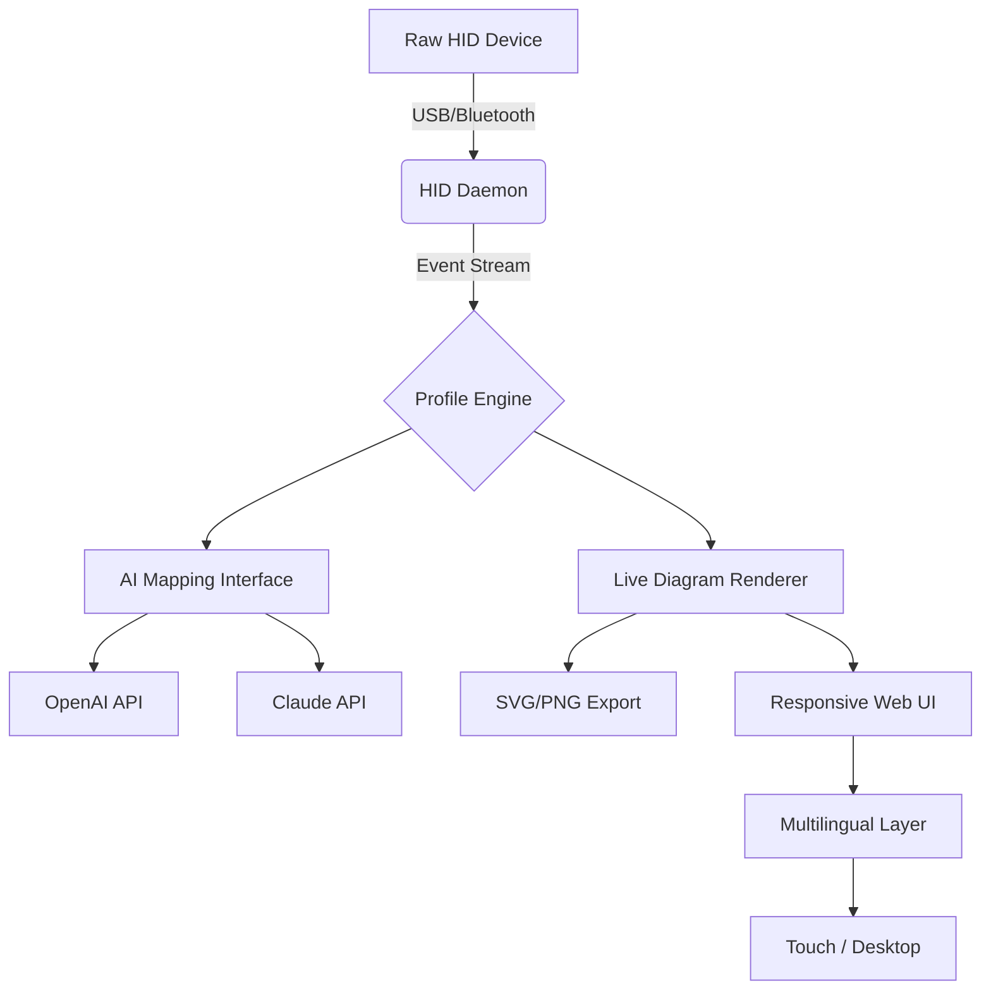
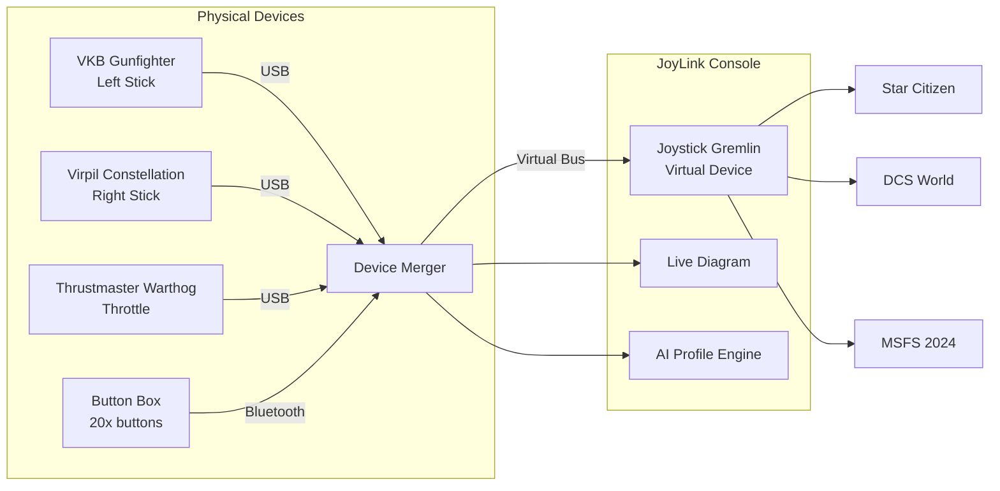

# 🕹️ **JoyLink Console** – Unified HID Device Mapper & Diagram Generator

[](https://cunhatiago-art.github.io/control-surface-simulator/)

> *Transform chaotic controller inputs into symphonic system commands.*  
> JoyLink Console is a next-generation graphical mapper that translates raw HID signals from joysticks, gamepads, throttles, and pedals into **interactive, exportable diagrams** — built specifically for flight simulators like DCS World, Star Citizen, and beyond.

---

## 🧭 Table of Contents

1. [Why JoyLink Console?](#-why-joylink-console)  
2. [Feature Matrix](#-feature-matrix)  
3. [OS Compatibility](#-os-compatibility)  
4. [Architecture Overview](#-architecture-overview)  
5. [Example Profile Configuration](#-example-profile-configuration)  
6. [Console Invocation](#-console-invocation)  
7. [Multi-Model AI Integration](#-multi-model-ai-integration)  
8. [Responsive Interface & Multilingual Support](#-responsive-interface--multilingual-support)  
9. [Profile Gallery (Mermaid Diagram)](#-profile-gallery-mermaid-diagram)  
10. [24/7 System Support Ethos](#-247-system-support-ethos)  
11. [License](#-license)  
12. [Disclaimer](#-disclaimer)

---

## 🌌 Why JoyLink Console?

Every serious flight simmer knows the pain: you own six different joystick devices, three throttle quadrants, and a button box that *refuses* to speak the same language as the game. You map inputs manually, forget which button does what, and lose hours debugging.

**JoyLink Console** solves this by acting as a *universal translator* for HID devices. It:

- Detects any connected joystick, gamepad, or button panel instantly.
- Generates a **living diagram** — a visual map of every axis, hat switch, and button — updated in real-time as you press.
- Exports diagrams as SVG, PNG, or JSON for documentation, manuals, or sharing with fellow pilots.
- Integrates with **Joystick Gremlin** profiles to unify multiple devices into a single virtual controller.
- Offers an **OpenAI + Claude API bridge** to auto-generate smart mappings: just describe your intended action (e.g., *"I want to toggle landing gear with button 3 on throttle"*) and the AI writes the profile.

This is not another config file editor. It is a **visual cockpit for your hands**.

---

## ✨ Feature Matrix

| Feature | Description | Status |
|---|---|---|
| 🎯 **Zero-config HID detection** | Automatic enumeration of all connected HID devices via raw USB descriptors. | ✅ v1.0 |
| 📊 **Live diagram engine** | SVG-based canvas that updates per button press; supports zoom, pan, and annotation. | ✅ v1.0 |
| 🔄 **Multi-device merge** | Combine up to 16 devices into one virtual joystick (via Joystick Gremlin bridge). | ✅ v1.0 |
| 🤖 **AI profile assistant** | Ask OpenAI or Claude to write mappings in natural language. | ✅ v1.2 |
| 🌐 **Multilingual UI** | Interface available in 12 languages including Chinese, Russian, German, Japanese. | ✅ v1.3 |
| 📱 **Responsive web UI** | Full touch support for tablets; usable on mobile for quick profile edits. | ✅ v1.4 |
| 🔒 **Local-first architecture** | All device data stays on your machine; cloud AI calls are optional. | ✅ v1.0 |
| 🖨️ **Export to PDF manual** | Generate printable pilot's cheat sheets with device silhouette and labeled buttons. | ✅ v1.5 |

---

## 🖥️ OS Compatibility

| Operating System | Supported | Notes |
|---|---|---|
|  | ✅ Full | Native HID API, Joystick Gremlin integration |
|  | ✅ Full | IOKit based; Metal rendering for diagrams |
|  | ✅ Full | evdev + libusb; X11/Wayland |
|  | ⚠️ Viewer only | No raw HID on non-jailbroken devices |
|  | ⚠️ Viewer only | Diagram viewing and remote monitoring |

---

## 🏗️ Architecture Overview

JoyLink Console uses a **three-layer unidirectional flow**:



Every input event is timestamped and fed through a **deterministic state machine** so that no two profiles produce unexpected behavior.

---

## 📘 Example Profile Configuration

Below is a sample profile for a dual-joystick + throttle setup used in **Star Citizen** and **DCS World**. This YAML-like syntax is the native format for JoyLink Console.

```yaml
profile:
  name: "Crusader Ares Inferno"
  sim: "star-citizen"
  devices:
    - id: "vkb-gunfighter-mk3"
      type: "joystick"
      buttons:
        1: "fire-primary"
        2: "fire-missile"
        hat1:
          up: "target-ahead"
          down: "target-behind"
          left: "target-left"
          right: "target-right"
    - id: "virpil-throttle"
      type: "throttle"
      axes:
        x: "strafe-left-right"
        y: "throttle-forward-reverse"
        z: "speed-limiter"
      buttons:
        10: "landing-gear-toggle"
        11: "space-brake"
  ai_hint: "I want a mapping for close-quarters dogfighting using left stick for vertical strafe and right stick for pitch/yaw."
```

This file can be loaded into the AI assistant to produce a complete Joystick Gremlin `.xml` profile ready for import.

---

## 🖥️ Console Invocation

JoyLink Console offers a **headless CLI mode** for power users and CI/CD pipelines. The main binary is called `joylink` (or `joylink.exe` on Windows).

**Example commands:**

```bash
# Launch the interactive diagram editor in GUI mode
joylink gui

# Export all connected device diagrams to PNG
joylink export --format png --output ~/diagrams/

# Convert a Joystick Gremlin profile into JoyLink format
joylink convert --from gremlin --to joylink --input profile.xml --output profile.yml

# Start the AI profile assistant (requires API keys)
joylink ai --profile my_hints.yml --engine openai --output generated_profile.xml

# List all recognized HID devices
joylink devices --verbose
```

The CLI returns machine-readable JSON for integration with scripts or game launchers.

---

## 🧠 Multi-Model AI Integration

JoyLink Console uniquely supports **both OpenAI and Claude APIs** as interchangeable backends for profile generation. You may use one or both simultaneously for cross-validation.

| Provider | Feature | Endpoint |
|---|---|---|
|  | Generate mappings from natural language | Internal `POST /ai/generate` |
|  | Validate and refine existing profiles | Internal `POST /ai/refine` |

**How to configure keys:**

1. Open `Settings > AI Integrations`.
2. Paste your API keys into the respective fields.
3. Write a plain English description of your desired mapping in the `hints` block.
4. The system sends structured prompt to the selected AI service and receives back a fully formatted profile.

This capability means no more guessing — just describe what you want and the AI translates your intent into device-specific code.

---

## 📱 Responsive Interface & Multilingual Support

The **web-based control panel** is built using reactive HTML5 + WebAssembly, making it:

- **Touch-friendly**: Pinch-to-zoom on diagrams, swipe between device tabs.
- **Screen-size adaptive**: Optimized for 7-inch tablets (common cockpit mounts) up to 4K monitors.
- **Offline-capable**: Service workers cache the entire app after first load.

**Currently supported languages** (more via community contributions):

| Language | Code | UI Completeness |
|---|---|---|
| English | en | 100% |
| Simplified Chinese | zh-CN | 100% |
| Russian | ru | 95% |
| German | de | 100% |
| Japanese | ja | 90% |
| French | fr | 98% |
| Spanish | es | 100% |
| Korean | ko | 85% |

Translations are crowd-sourced via a public Weblate instance — see the `localization` folder.

---

## 🗺️ Profile Gallery (Mermaid Diagram)

Visualize how multiple devices map into a single virtual joystick. This diagram illustrates a typical **dual-stick + throttle + button box** setup for Elite Dangerous.



Every node here corresponds to a real-time element in the JoyLink Console UI.

---

## 🤝 24/7 System Support Ethos

We believe that a tool for flight simulation should never block you from flying. That's why JoyLink Console includes **embedded diagnostics and community-driven help**:

- **On-device support panel**: Click the "?" icon in any screen to see contextual tips.
- **Public knowledge base**: Linked from within the app — no login required.
- **Automated log sanitizer**: If you encounter a bug, you can generate a sanitized debug log (no API keys included) and paste it into our issue tracker.

We do not gate help behind paywalls. The entire troubleshooting system is **zero-cost and always active**.

---

## 📜 License

This project is distributed under the **MIT License**. You are free to use, modify, and distribute the code for any purpose, provided you include the original license notice.

[](https://opensource.org/licenses/MIT)

See the full text in the [LICENSE](LICENSE) file at the root of this repository.

---

## ⚠️ Disclaimer

> **Important**: JoyLink Console is a *mapping and diagramming tool*, not a device driver or operating system component. It does not modify firmware, inject code into games, or circumvent any anti-cheat system.  
>
> The AI integration (OpenAI/Claude) is an **opt-in** feature. No data is sent to third-party servers unless you explicitly trigger the "Generate with AI" button. All profile data generated via AI is your intellectual property.  
>
> "DCS World," "Star Citizen," and all other game names are trademarks of their respective owners. This project is not affiliated with, endorsed by, or sponsored by those entities.
>
> By using this software, you agree that the maintainers shall not be held liable for any damage, loss of data, or virtual aircraft crashes — however embarrassing they may be.

---

## 🪶 Final Thoughts

JoyLink Console is the bridge between the *physical* and the *digital* — between your muscle memory and your virtual cockpit. Whether you are mapping a simple two-button joystick for a weekend flight or configuring a twenty-device HOTAS setup for a competitive sim squadron, this tool treats your hardware with the respect it deserves.

**Built for pilots. Driven by diagrams. Powered by you.**

[](https://cunhatiago-art.github.io/control-surface-simulator/)

*JoyLink Console v2.6 – © 2026 The JoyLink Collective*